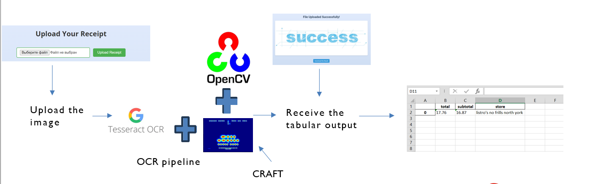

# OCR with Django Web App

## Abstract
In this project the aim is to extract text information from receipts images. 
We allow extracting information from one image only for now.
The application is wrapped into a simple Django app.

## Prerequisites

1. You have to install our Custom_CRAFT package to run the code. This is a modification of original CRAFT package. Note that you have to install Python 3.9 or lower to run CRAFT.
2. You have to establish your Open AI key to use GPT API.

## How to run

1. Make sure you have installed our modified CRAFT package (link is below)
2. Create venv with this directory
3. activate venv
4. Install the requirements from requirements.txt
5. Run Django Configuration
6. Upload any photo from sample data folder (* need to add) to the website. 
7. wait and download the resulting Excel file

## Methodology
1. Text Region Identification: CRAFT package is used to get the ROI's in the image.
2. Text Extraction: EasyOCR is used for text extraction.
3. Text Analysis with LLM: GPT-4 is used to extract text information from OCR data.
   
Links:
- Original CRAFT: [Link](https://github.com/clovaai/CRAFT-pytorch)
- Custom CRAFT: [Link](https://github.com/Maestro-111/Custom-Craft.git)
- EasyOCR: [Link](https://github.com/JaidedAI/EasyOCR)

## Evaluations

- Evaluation Metrics: Accuracy (to do unit testing).
- Limitations: Dependency on image quality.

## TO DO

1. Work on GPT prompt. Not accurate in identifying address.
2. Add unit testing
3. Code refactoring for multiple and single receipts parsing
4. Integrate information save to SQL

